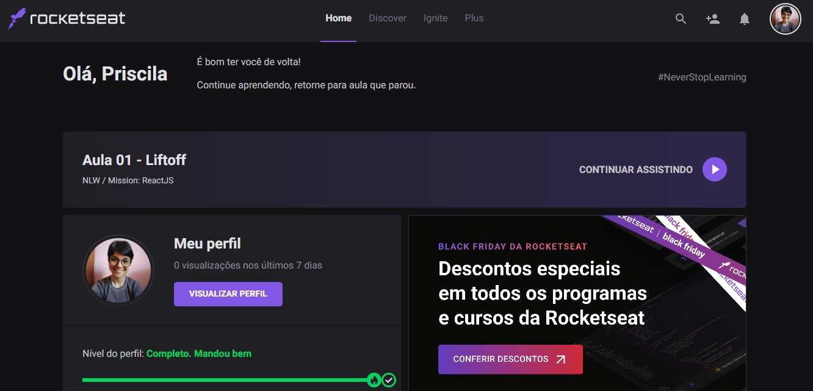
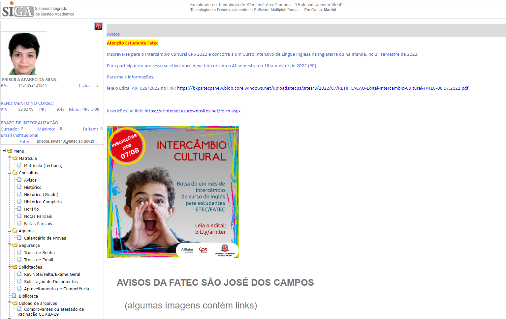
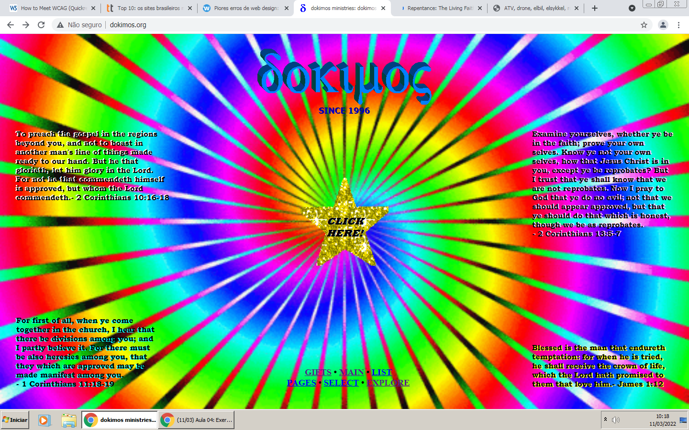

# Heurísticas de Nielsen e WCAG

## Exemplos de acertos ✔️

   
<b>1.3 Adaptable</b>

     
    O sistema deve mostrar o que está acontecendo em tempo real pro usuário, um exemplo disso é a interface das playlists Youtube, que ficam ao lado direito do vídeo, mostrando qual vídeo da lista estamos assistindo, qual os próximos e quais já foram assistidos para que o usuário tenha uma visibilidade do status do sistema.

  

   
<b>2.4 Navigable</b>

     
    O sistema deve permitir que o usuário tenha liberdade para realizar ações que ele deseja, como no caso do Sistema de Aprendizagem da RocketSeat. O usuário aluno poder nevegar em sua home, ir para cursos que está em desenvolvimento, assistir a vídeos com conteúdos voltados para o aprendizado, e também, emitir certificados após a conclusão de seu curso. Essa heurística visa a navegabilidade fácil, rápida e intuitiva por parte do usuário para encontrar o que precisam.

   
  

   
<b>4.1 Compatible</b>

     
    Um dos maiores exemplos dessa heurística é o próprio site do Google, onde a inteção principal é realizar uma pesquisa e, portanto, o foco da página vai unicamente para a propria barra de pesquisa. Melhor que deixar o usuário resolver um erro é evitar que ele cometa erros, que, enquanto estamos digitando na barra de pesquisa, ele apresenta algumas sugestões e também corrigindo erros de ortografia caso tenhamos pesquisado algo errado e sugerindo algo que seja mais coerente ao que digitamos. Acrescentando também para a versão Mobile, onde tem a possibilidade de falar no alto falante o que ele precisa pesquisar quando não consegue digitar. Isso é muito válido para idosos com dificuldades de entendimento e analfabetismo e também para pessoas portadoras de necessidades especiais.
    
  

   
     
  

---

## Exemplos de erros ❌

   
<b>3.1 Readable</b>

     

    
    
  

> **Observações:** O sistema academico aparenta dificuldades do usuário por não facilitar na leitura de forma confortável e didática para o aluno. Utiliza exageradamente de informações na tela e com textos demasiadamente pequenos, que poderiam estar melhor organizados em um layout que comportaria como tal. Não há a presença de padrões, não há familiaridade do usuário com as funcionalidades disponíveis.

   
<b>2.3.1 - Three Flashes or Below Threshold Level A</b>

     

    
  

> **Observações:** O site se mostra com muitas cores misturadas, não colaborando para uma harmonia visual do usuário; o texto é ilegível por conta do baixo contraste entre o background e a cor do texto, além de não utilizar uma fonte simples e de fácil legibilidade; elementos piscando e se mexendo em todos os cantos da tela, podendo apresentar riscos de convulsões e confusão mental em alguns usuários.

---
