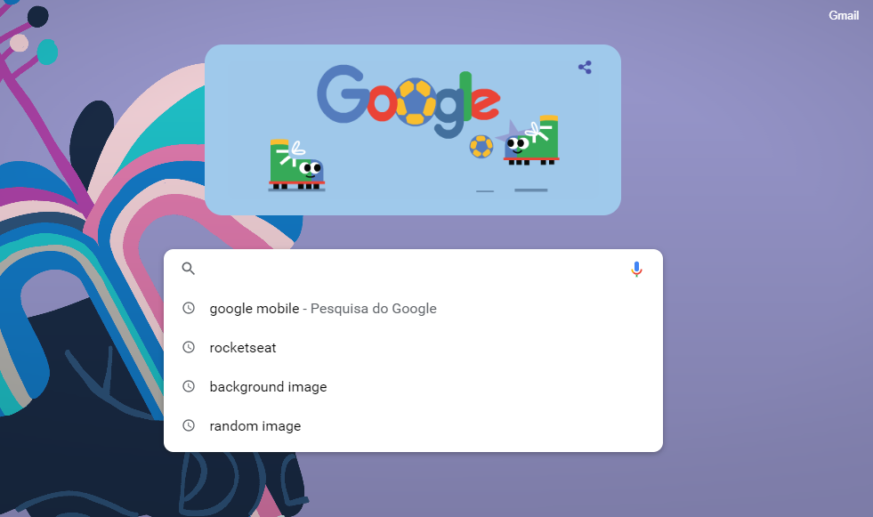
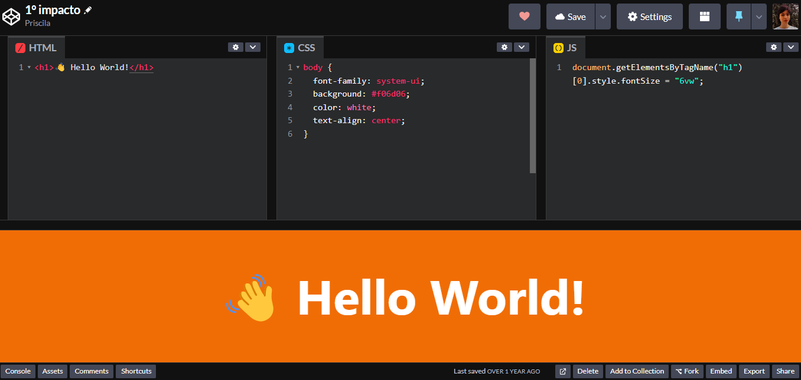
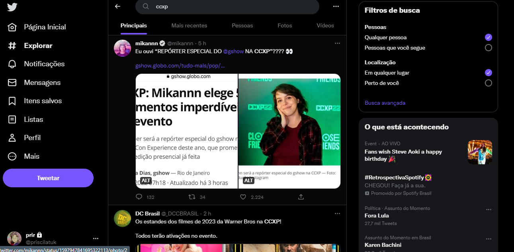
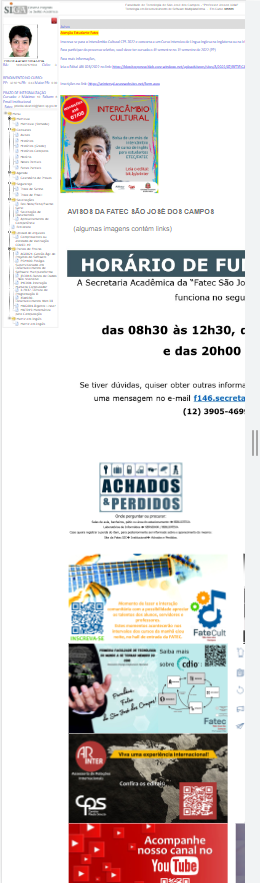
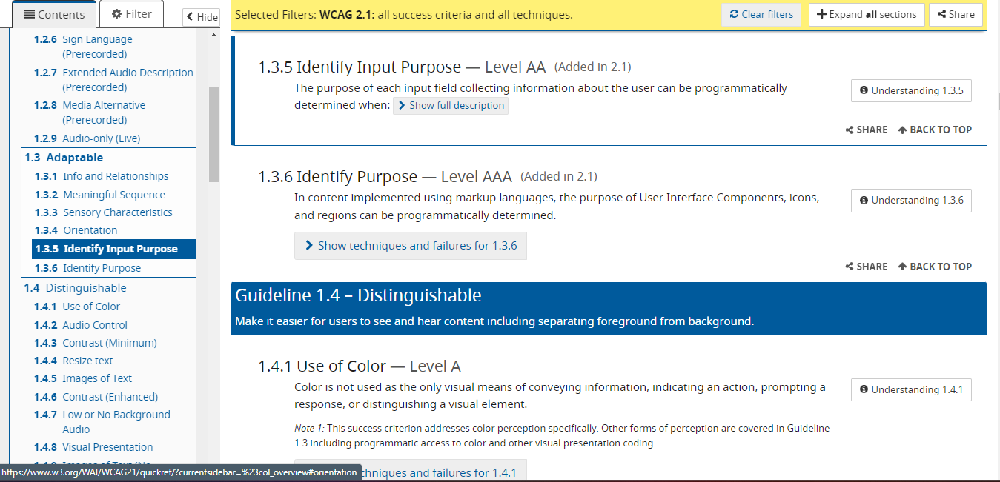
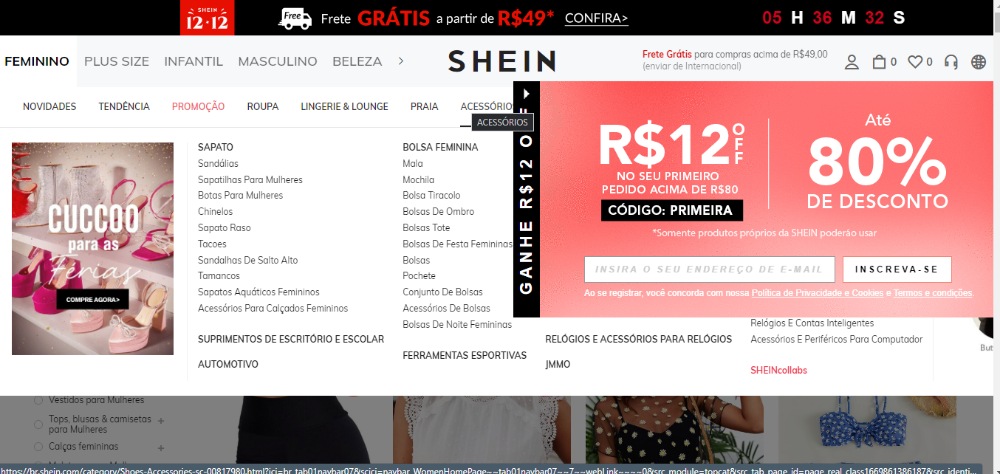

# Heurísticas de Nielsen e WCAG

> Prof. Giuliano Araujo Bertoti 
>
> Objetivo: 
>  Apresentar conceitos fundamentais de usabilidade, acessibilidade, UX e etc, escolhendo 1 ou mais sites e fazer uma avaliação heurística com base no WCAG. E inserindo prints de erros e acertos, comentando abaixo a guideline avaliada e o que está certo ou errado.
>
> **Link do Site:** https://www.w3.org/WAI/WCAG21/quickref/

## Exemplos de acertos ✔️

    
<b>1.3 Adaptable</b>

     
    <ul>
        <li>O sistema deve mostrar o que está acontecendo em tempo real pro usuário, um exemplo disso é a interface das playlists Youtube, que ficam ao lado direito do vídeo, mostrando qual vídeo da lista estamos assistindo, qual os próximos e quais já foram assistidos para que o usuário tenha uma visibilidade do status do sistema.</li>
    </ul>
    

        
    

    
<b>2.4 Navigable</b>

     
    <ul>
        <li>O sistema deve permitir que o usuário tenha liberdade para realizar ações que ele deseja, como no caso do Sistema de Aprendizagem da RocketSeat. O usuário aluno poder nevegar em sua home, ir para cursos que está em desenvolvimento, assistir a vídeos com conteúdos voltados para o aprendizado, e também, emitir certificados após a conclusão de seu curso. Essa heurística visa a navegabilidade fácil, rápida e intuitiva por parte do usuário para encontrar o que precisam.</li>
    </ul>
    

        
    

    
<b>4.1 Compatible</b>

     
    <ul>
        <li>Um dos maiores exemplos dessa heurística é o próprio site do Google, onde a inteção principal é realizar uma pesquisa e, portanto, o foco da página vai unicamente para a propria barra de pesquisa. Melhor que deixar o usuário resolver um erro é evitar que ele cometa erros, que, enquanto estamos digitando na barra de pesquisa, ele apresenta algumas sugestões e também corrigindo erros de ortografia caso tenhamos pesquisado algo errado e sugerindo algo que seja mais coerente ao que digitamos. Acrescentando também para a versão Mobile, onde tem a possibilidade de falar no alto falante o que ele precisa pesquisar quando não consegue digitar. Isso é muito válido para idosos com dificuldades de entendimento e analfabetismo e também para pessoas portadoras de necessidades especiais.</li>
    </ul>
    

        
        
    

    
<b>3.2.3 Consistent Navigation</b>

     
    <ul>
        <li>O CodePen é um ambiente de desenvolvimento e uma rede social ao mesmo tempo, isso quer dizer que além de poder seguir pessoas, dar like em códigos e deixar comentários. Ele funciona como um editor de código online e ambiente de aprendizado de código aberto, onde os desenvolvedores podem criar trechos de código, chamados de "canetas", e testá-los no mesmo que estão desenvolvendo.</li>
    </ul>
    

        
    

    
<b>1. Perceivable</b>

     
    <ul>
        <li>O Twitter é uma rede social e um serviço de microblog, que permite aos usuários enviar e receber atualizações pessoais de outros contatos, por meio do website do serviços de troca de informações para receber na íntegra onde o usuario consegue perceber, de forma imediata, o que está sendo compreendido nas noticias e assuntos mais comentados do momento. Evidencia para o usuario as possíveis buscas que ele pode realizar em um determinado assunto ou perfil de outro usuario que quer encontrar.</li>
    </ul>
    

        
    

## Exemplos de erros ❌

   
<b>3.1 Readable</b>

     

    
    
  

> **Observações:** O sistema academico aparenta dificuldades do usuário por não facilitar na leitura de forma confortável e didática para o aluno. Utiliza exageradamente de informações na tela e com textos demasiadamente pequenos, que poderiam estar melhor organizados em um layout que comportaria como tal. Não há a presença de padrões, não há familiaridade do usuário com as funcionalidades disponíveis.

   
<b>2.3.1 - Three Flashes or Below Threshold Level A</b>

     

    
  

> **Observações:** O site se mostra com muitas cores misturadas, não colaborando para uma harmonia visual do usuário; o texto é ilegível por conta do baixo contraste entre o background e a cor do texto, além de não utilizar uma fonte simples e de fácil legibilidade; elementos piscando e se mexendo em todos os cantos da tela, podendo apresentar riscos de convulsões e confusão mental em alguns usuários.

   
<b>2.4.8 Location Level AAA</b>

     

    
  

> **Observações:** O site, mesmo sendo de fundamental consulta para as heuristicas, mostra-se confuso para os usuarios em questão da localização onde se encontra essas informações. Dando o scrool na sidebar para buscas, o foco da tela principal automaticamete se movimenta junto e isso causa um desconforto e confusao onde o usuario precisa procurar novamente a heuristica que estava lendo.

   
<b>1.4.8 Visual Presentation</b>

     

    
  

> **Observações:** O site de compras da Shein se tornou bastante conhecido nas suas diversas opções e variedades de roupas e estilos. O site apresenta de forma desnecessária diversas informações de uma vez na pagina home, tornando o primeiro contato do usuário. Alguns podem se assustar com a quantidade de coisas que mostram, despertanto desconforto e desconfiabilidade do usuario em achar que pode ser virus para seu computador.

   
<b>1.4.3 Contrast (Minimum) Level AA</b>

     

    
  

> **Observações:** O site apresenta as cores do fundo com a do texto numa faixa de contraste muito baixa, fazendo com que o usuário tenha dificuldade em ler o que está escrito e principalmente perdendo informações que podem ser importantes. Acrescentando o layout de defícil interpretação pois não possuem as dimensões corretas de resolução padrão de uma tela.

---
